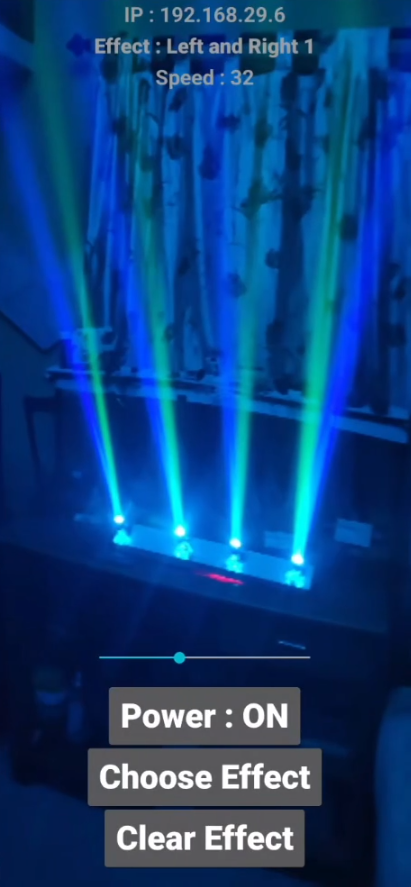
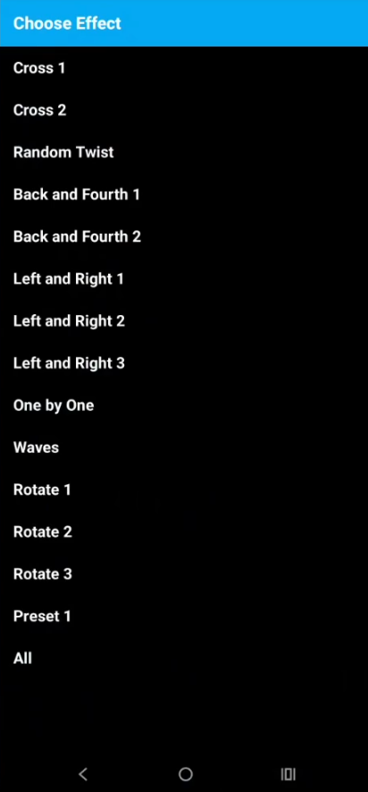

## ESP32-based 4-channel moving head RGB lighting fixture

## Features

- **Art-Net for LEDs**
  - RGB LEDs can be controlled and synced to music using [LedFx](https://github.com/LedFx/LedFx) or any other software that supports Art-Net.

- **Smartphone App**
  - Servo movements and preprogrammed movements can be played through the Sparky built with MIT App Inventor.
  - The app talks to the ESP32 via UDP.

  
  

## Hardware

- ESP32 microcontroller  
- PCA9685 16-channel servo driver  
- 8 servo motors (4 pan + 4 tilt)  
- IRLZ44N MOSFET to control the LEDs.
- 300ma RGB LEDs  

## YouTube Video

